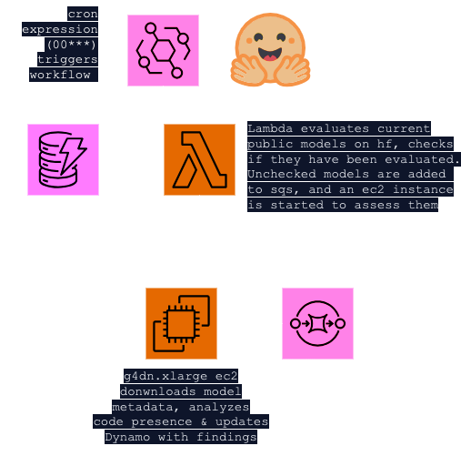

# Welcome to Bhakti CDK!!

DBX Threat Intelligence 🤝 Infrastructure as Code

The CDK contained here is intended to help folks get started using AWS to look at ML models. There are two main ways to deploy bhakti's cdk-- for monitoring or for a launch template. 

## Pre-Requisites 

Deploying this stack requires that you have an AWS account that's been bootstrapped for CDK (see [Bootstrapping](https://docs.aws.amazon.com/cdk/v2/guide/bootstrapping.html)) and an IAM identity with adequate permissions that you can run the cdk commands from. Whatever you've used to bootstrap your account should be able to deploy your stack.  

Don't have cdk? Check out [Getting Started with CDK](https://docs.aws.amazon.com/cdk/v2/guide/getting_started.html) for more info.

If you're planning to deploy the monitoring stack, you'll need to have Docker running on your machine (it bundles the requests library into the Lambda using a docker container)

If you're using a f r e s h AWS account, you will probably have to request that AWS grant you a quota for running G class instances. You can do that using the [service quotas dashboard](https://console.aws.amazon.com/servicequotas/home/services/ec2/quotas#) and looking for "Running On-Demand G and VT instances." One `G4DN.XLARGE` has 4vCPUs (which is the quota restricts). 

## Launch Template Stack 

The [Launch Template Stack](bhakti_cdk/bhakti_instance_profiles.py) will create an ec2 launch template for you that you can then use to run instances in your account for manual analysis. 
- It's got an instance role attached that can get a secret from secrets manager (for your huggingface api key) 
- It copies over the contents of the [analysis directory](analysis) to the ec2 instance under the `/home/ec2-user/analysis` directory 
- If you launch the stack with a security group id (`sg-{id}`) in the context, it will attach that security group to the ec2 instance by default. For more about security groups, see [this documentation](https://docs.aws.amazon.com/AWSEC2/latest/UserGuide/ec2-security-groups.html). Basically, you'll need at least a security group allowing SSH access from your IP or a CIDR including your IP to be able to ssh to the ec2 instance. If  you don't specify one, you can always attach one either when you choose to launch an instance or even after it's running. 
- The keypair for the analysis instances will default to one the cdk creates and stores in ssm. 
- This stack does *not* start any instance for you, it simply creates an [EC2 Launch template](https://docs.aws.amazon.com/AWSEC2/latest/UserGuide/ec2-launch-templates.html) for manual instance usage. 

### ✨ **Deployment** ✨

To stand-up this stack run the following commands: 

```
$ cdk synth --context deploy_type=instance_profile --context deploy_region={region} --context deploy_account={aws_account_id} --context sg_id={your_security_group_to_attach}
$ cdk deploy --context deploy_type=instance_profile --context deploy_region={region} --context deploy_account={aws_account_id} --context sg_id={your_security_group_to_attach} --all
```

You can also store these context variables in the [`cdk.context.json`](cdk_context.json) file in json format. 


### ✍️ **Post-Deployment** ✍️

You'll need to do at least two things post-deployment:
1. Add your huggingface api key to the blank secret we created in this cdk stack. It'll be under the name "huggingface_api_token" unless you've modified it. 
```
$ aws secretsmanager put-secret-value --secret-id 'huggingface_api_token' --secret-string "myhfapitoken"
{
    "ARN": "arn:aws:secretsmanager:{region}:{account_id}:secret:huggingface_api_token-{version-id}",
    "Name": "huggingface_api_token",
    "VersionId": "f45a72e9-5e1f-4147-b81f-ac48f2c8e4d6",
    "VersionStages": [
        "AWSCURRENT"
    ]
}
```
2. Grab the private key for your ssh keypair from the ssm parameter store:
```
$ aws ec2 describe-key-pairs | grep -B 2 -A 3 'bhakti-ssh-key'
            "KeyPairId": "key-$guid",
            "KeyFingerprint": "4b:2d:02:1b:bb:ec:6b:e0:30:32:39:66:68:5d:ca:68:e0:0e:16:d8",
            "KeyName": "bhakti-ssh-key",
            "KeyType": "rsa",
            "Tags": [],
            "CreateTime": "2024-04-12T22:30:08.693000+00:00"

$ aws ssm describe-parameters --parameter-filters Key=Name,Values='/ec2/keypair/key-06792029fba76ba97'
{
    "Parameters": [
        {
            "Name": "/ec2/keypair/key-$guid",
            "ARN": "arn:aws:ssm:us-west-2:{account_id}:parameter/ec2/keypair/key-$guid",
            "Type": "SecureString",
            "KeyId": "alias/aws/ssm",
            "LastModifiedDate": "2024-04-12T15:30:08.779000-07:00",
            "LastModifiedUser": "{arn of user identity}",
            "Version": 1,
            "Tier": "Standard",
            "Policies": [],
            "DataType": "text"
        }
    ]
}

$ aws ssm get-parameters --name='/ec2/keypair/key-$guid'                             
{
    "Parameters": [
        {
            "Name": "/ec2/keypair/key-$guid",
            "Type": "SecureString",
            "Value": "{ base64 encoded private key }",
            "Version": 1,
            "LastModifiedDate": "2024-04-12T15:30:08.779000-07:00",
            "ARN": "{ arn of key }",
            "DataType": "text"
        }
    ],
    "InvalidParameters": []
}

```

## Monitoring Stack 

The [Monitoring Stack](bhakti_cdk/bhakti_monitoring_stack.py) attempts to stand up a little automation service that will let you monitor huggingface each day for new models to assess. By default, it looks at `keras_metadata.pb` files, runs my stock analysis script over those files, and stores results in a DynamoDB table. If you want to change what's done, follow your heart and modify the script that runs when a new model is found: [monitoring_ec2_check.py](analysis/monitoring_ec2_check.py). 

Here's the architecture of what the cdk will stand-up in your account: 



### 💸 *Small caution regarding billing* 💸
If you're thinking about putting this in a personal account, please be advised that it will want to look at > 3.5k model metadata files to start out. It's not a huge amount (they're so tiny), but the ML instance used to assess them is a `G4DN.XLARGE`, which costs ~$0.52 an hour to run (with no discounts) based on current pricing. To just write model candidates to SQS and look them over more manually (maybe run yara on them and find the ones you care about?!), you could simply change the conditional check on [line 171 of the lambda](lambda/monitoring_lambda.py#L171) to never evaluate to be true. 

### ✨ **Deployment** ✨
```
$ cdk synth --context deploy_type=monitoring --context deploy_region={region} --context deploy_account={aws_account_id}
$ cdk deploy --context deploy_type=monitoring --context deploy_region={region} --context deploy_account={aws_account_id} --all
```
You can also store these context variables in the [`cdk.context.json`](cdk_context.json) file in json format. 

### ✍️ **Post-Deployment** ✍️
1. You'll need to add your huggingface api key to the secret we created when we stood up this stack, if you haven't done so already. It'll be under "huggingface_api_token" unless you've altered it. 
```
$ aws secretsmanager put-secret-value --secret-id 'huggingface_api_token' --secret-string "myhfapitoken"
{
    "ARN": "arn:aws:secretsmanager:{region}:{account_id}:secret:huggingface_api_token-{version-id}",
    "Name": "huggingface_api_token",
    "VersionId": "f45a72e9-5e1f-4147-b81f-ac48f2c8e4d6",
    "VersionStages": [
        "AWSCURRENT"
    ]
}
```

### **AWS Services Used**
- AWS Lambda to identify f r e s h models once per day
- AWS Events to trigger the Lambda to run once per day
- AWS SQS stores json events correlating to models we find with lambda and want to assess
- AWS DynamoDB has a table with a complete record of our models we've assessed (we update it from Lambda and EC2)
- AWS EC2 functions as our compute to analyze updated models. The instance is started by Lambda and shuts itself down when its launch script completes work (we are afraid of EC2 bills).
- AWS S3 Stores analysis scripts to load onto EC2 instances and logs from EC2 work. 
- CloudWatch Logging for the Lambda

## Useful commands

 * `cdk ls`          list all stacks in the app
 * `cdk synth`       emits the synthesized CloudFormation template
 * `cdk deploy`      deploy this stack to your default AWS account/region
 * `cdk diff`        compare deployed stack with current state
 * `cdk docs`        open CDK documentation

Enjoy!
